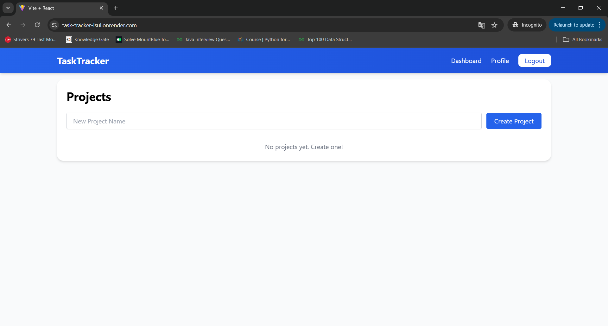
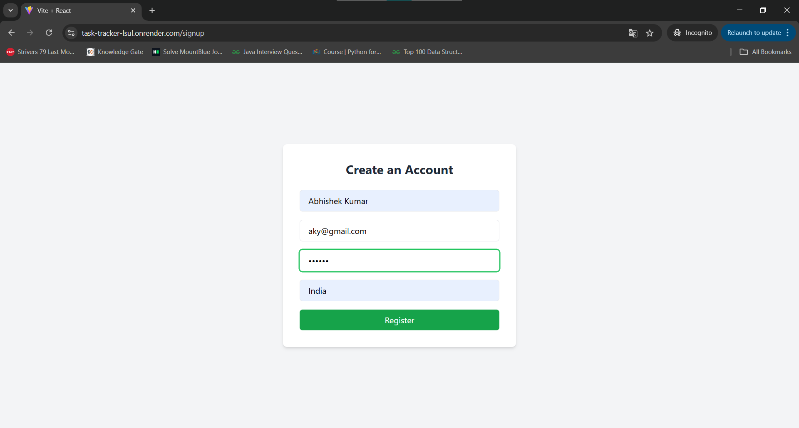
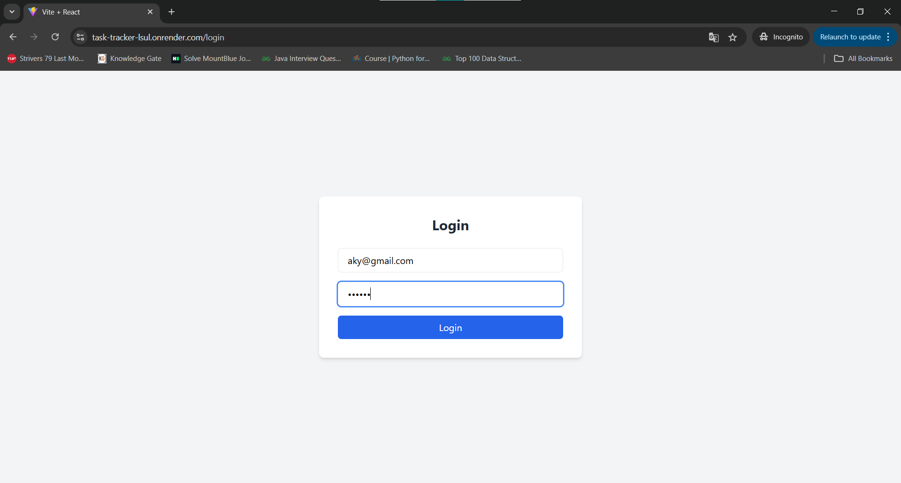
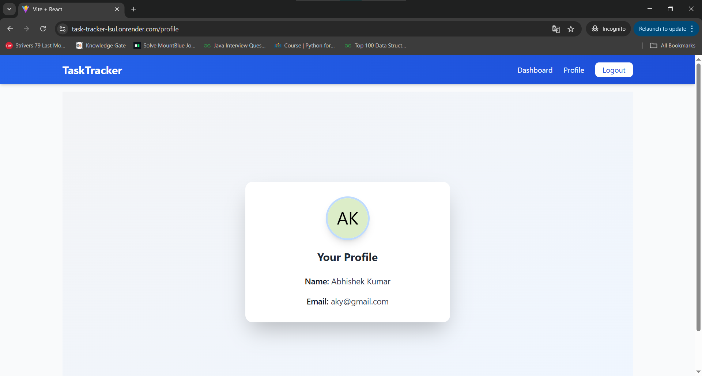
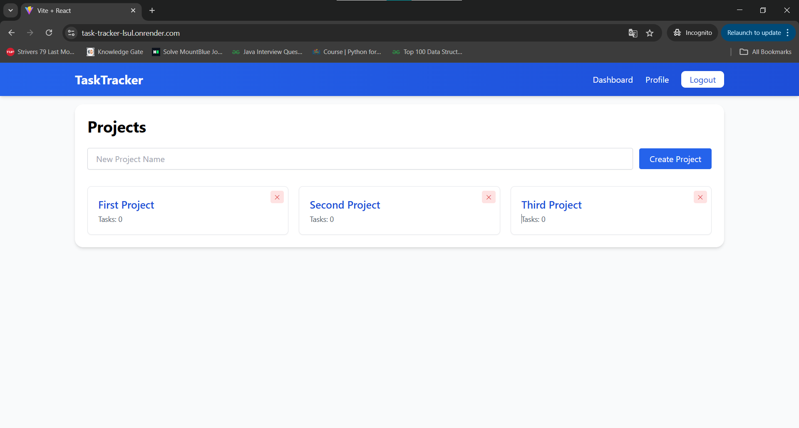
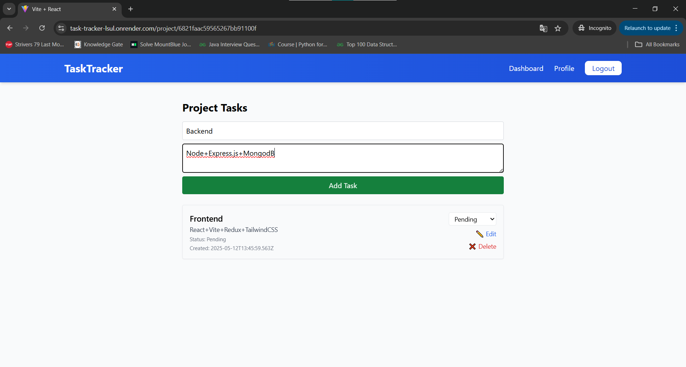
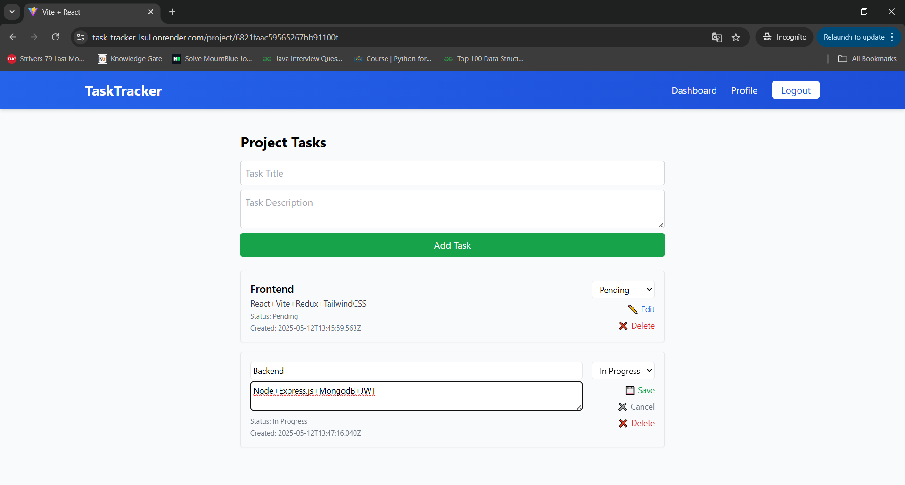
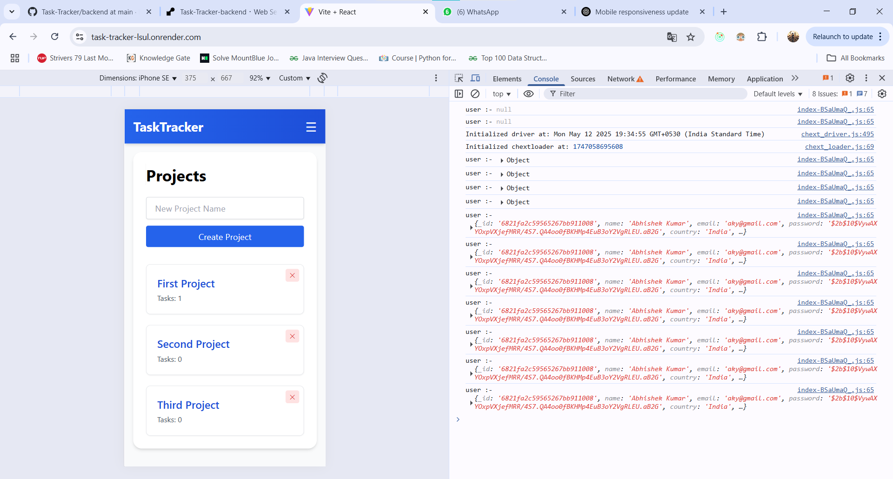
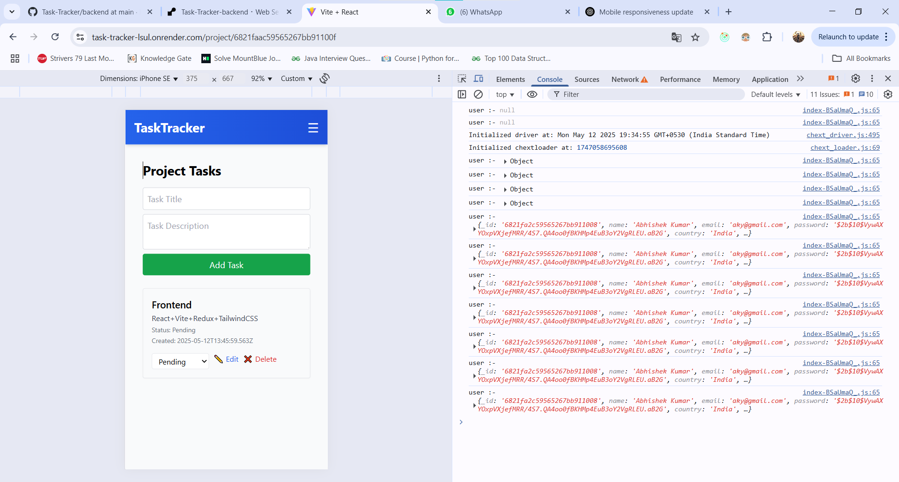

# Task Tracker

A full-stack task and project management application built with **React**, **Express**, **MongoDB**, and **Tailwind CSS**. It allows users to manage multiple projects, create tasks, assign statuses, and track productivity.

---

## Features

* User Authentication (JWT-based)
* Create, Read, Update, Delete (CRUD) operations for Projects and Tasks
* Responsive UI using Tailwind CSS
* RESTful API
* Render used for deployment

---

## Tech Stack

**Frontend**:

* React (Vite)
* Redux Toolkit
* Tailwind CSS

**Backend**:

* Node.js + Express
* MongoDB (Mongoose)
* JWT for authentication

---

## Screenshots










---

## 🌐 Live Demo

👉 [Click here to view live demo](https://task-tracker-lsul.onrender.com/)

---
### Local Setup

1. Clone the repository:

```bash
git clone https://github.com/Khiladi19/Task-Tracker.git
cd task-tracker
```

2. Set up environment variables: Create `.env` files in `backend/` and `frontend/` directories.

#### backend/.env

```env
PORT=5000
MONGO_URI=your_mongo_url
JWT_SECRET=your_jwt_secret
```

#### frontend/.env

```env
VITE_API_URL=http://localhost:5000/api
```

3. Install dependencies:

```bash
cd backend && npm install
cd ../frontend && npm install
```

4. Run the app locally:

```bash
# In backend/
npm run dev

# In frontend/
npm run dev
```

---
## API Endpoints

### Authentication

* `POST /api/auth/register` – Register new user
* `POST /api/auth/login` – Login and get JWT

### Users

* `GET /api/users/profile` – Get current user profile

### Projects

* `GET /api/projects` – List all projects
* `POST /api/projects` – Create a new project
* `PUT /api/projects/:id` – Update a project
* `DELETE /api/projects/:id` – Delete a project

### Tasks

* `GET /api/tasks` – List all tasks
* `POST /api/tasks` – Create a new task
* `PUT /api/tasks/:id` – Update a task
* `DELETE /api/tasks/:id` – Delete a task

---

## Folder Structure

```bash
task-tracker/
├── backend/         # Express backend (API)
│   ├── controllers/
│   ├── models/
│   ├── routes/
│   └── middlewares/
├── frontend/        # React + Tailwind frontend
├── screenshots/     # Images for documentation
├── docker-compose.yml
└── README.md
```

---

## Contributors

* [Abhishek kumar](https://github.com/Khiladi19?tab=repositories) – Developer & Maintainer

---

## License

This project is licensed under the MIT License. See the [LICENSE](./LICENSE) file for details.


